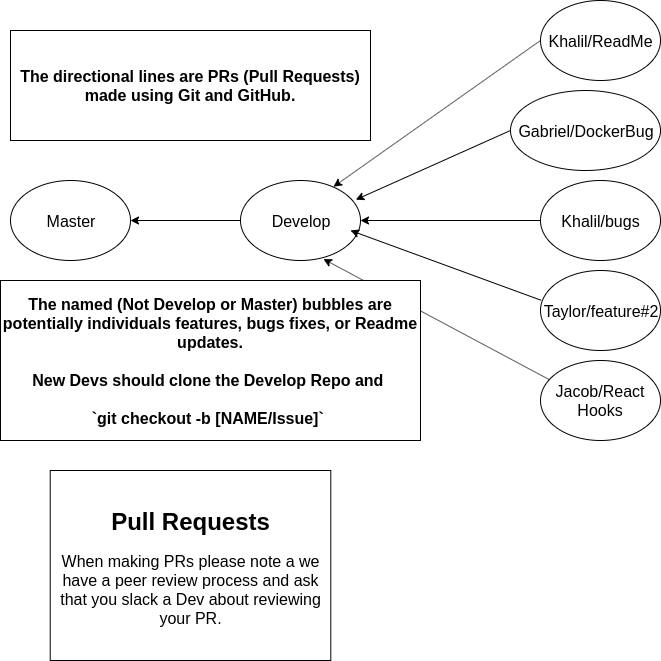

# phlask-map
Code behind the Phlask Web Map

## Running Locally
### Yarn
1. Ensure you have [Yarn](https://yarnpkg.com/en/) installed on your machine
1. Run `yarn install`
1. Run `yarn start`
### Docker (Recommended path for consistency across computers)
1. You will need to have Docker installed: https://www.docker.com
1. Once Docker is installed, run `docker-compose build app` and then `docker-compose up app` from the root of this repository.
1. Navigate to localhost:3000 on your browser.

## Want to add something new or develop/report a fix for a bug you found?
See our [Contribution Guide](contributing.md) to learn about our branching strategy and issue reporting etiquette, and more!

## Branching strategy 

## Goals
The technical goals for this project are:
- Usability on web and mobile
  - Currently planning on using a Progressive Web App (PWA) approach (via ReactJS) to solve this
- Fast access to useful information about where you can get water nearby
  - Implemented via our Nearest Tap Route

## Architecture
The Phlask Map runs on a static page built with:
- ReactJS (https://reactjs.org)
  - Builds the static content that composes the map page
- React Bootstrap (https://react-bootstrap.netlify.com)
  - Provides pre-built components with Bootstrap-styling baked-in
- GitHub Actions (https://github.com/features/actions)
  - Runs the required compute to build the site on ReactJS

The site runs on:
- AWS S3 (https://aws.amazon.com/s3/)
  - Stores the static files generated from the ReactJS build which present the map page 
- AWS CloudFront (https://aws.amazon.com/cloudfront/)
  - Serves as a global Content Delivery Network (CDN) for the content hosted in S3
  - Enables us to have a custom domain with SSL in order to ensure your traffic to the page is encrypted via HTTPS (https://en.wikipedia.org/wiki/HTTPS)
